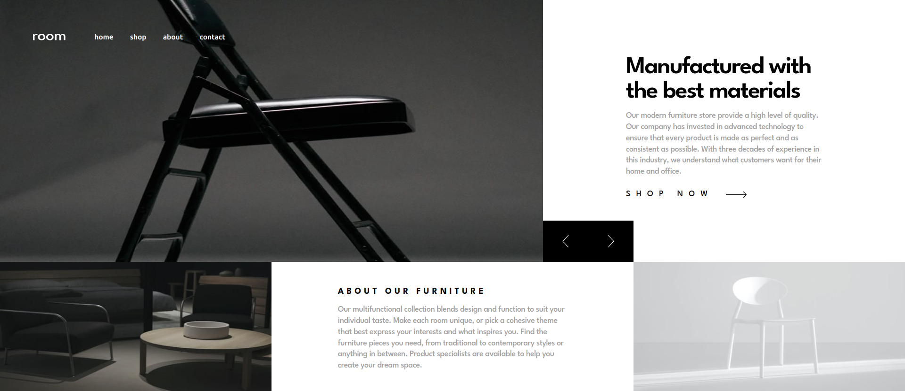

# Frontend Mentor - Room homepage solution

This is a solution to the [Room homepage challenge on Frontend Mentor](https://www.frontendmentor.io/challenges/room-homepage-BtdBY_ENq). Frontend Mentor challenges help you improve your coding skills by building realistic projects. 

## Table of contents

- [Overview](#overview)
  - [The challenge](#the-challenge)
  - [Screenshot](#screenshot)
  - [Links](#links)
- [My process](#my-process)
  - [Built with](#built-with)
  - [Useful resources](#useful-resources)
- [Author](#author)
- [Acknowledgments](#acknowledgments)

## Overview

### The challenge

Users should be able to:

- View the optimal layout for the site depending on their device's screen size
- See hover states for all interactive elements on the page
- Navigate the slider using either their mouse/trackpad or keyboard

### Screenshot

### Links

- Solution URL: [Here](https://github.com/ferdinandoaspro/room-homepage)
- Live Site URL: [Here](https://room-homepage-seven-black.vercel.app/)

## My process

### Built with

- Semantic HTML5 markup
- CSS custom properties
- Flexbox
- CSS Grid
- Mobile-first workflow
- [React](https://react.dev/) - JS library
- [Tailwind](https://tailwindcss.com/) - CSS framework
- [Typescript](https://www.typescriptlang.org/)

### Useful resources

- [The official React documentation](https://react.dev/)
- [The official Tailwind documentation](https://tailwindcss.com/docs/installation)

## Author

- Github - [Ferdinando Aspro](https://github.com/ferdinandoaspro)
- Frontend Mentor - [@ferdinandoaspro](https://www.frontendmentor.io/profile/ferdinandoaspro)
